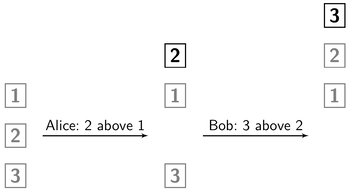
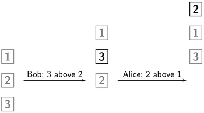
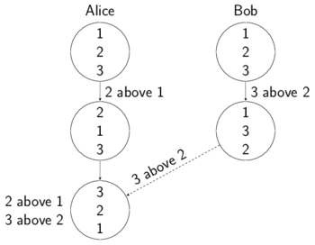

# Vertical Move
This document describes how the vertical move operation works.
The operation changes the order of elements in an ordered list.
First, it is discussed how such an operation can be modeled.
When two vertical move operations are done concurrently, there must be an algorithm which merges them. This algorithm is explained in the second chapter. Finally, some adjustments to the algorithm are explained which lead to performance improvements.

## Defining a vertical move operation
A vertical move operation can be defined in at least two ways: By decreasing the index or by providing a target. In this section, both ways are introduced and then compared regarding the desired merge results. In the implementation of the vertical move algorithm only one of the two ways is used.

#### Decrease index
A vertical move operation can be modeled by defining, that the index of a specific element should be decreased.

Example:
On a list `1, 2, 3` these two operations are applied one after another:
* Alice: VerticalMove(2, up)
* Bob: VerticalMove(3, up)

Look at the graphics below: When Alice's operation is applied to the list in the first column, the result is the list in the second column. The elements which changed order are colored black. The index of `2` was decreased by one and therefore the index of `1` increased. When Bob's operation is applied then, the result is the list in the third column.


The next graphics shows the same process for the contrary order, first Bob then Alice. The result is `1, 2, 3`. That is the same order as in the beginning.


Thus, when applying operations, the order matters.

#### Provide a target
A vertical move operation can be modeled by providing a target element, above which the moved element should end up.

Example:
* Alice: VerticalMove(2, above, 1)
* Bob: VerticalMove(3, above, 2)

The graphics below visualizes applying the two operations. The `3` is not moved up now, but moved above the `2`. Since the `2` changed its position, the result is `3, 2, 1`.



The contrary order, first Bob then Alice, can be applied here, too. Its result is `2, 1, 3`, as seen in the graphics below.



Let's compare the two results:

|  | Alice, then Bob: `3, 2, 1` | Bob then Alice: `2, 1, 3` |
| --- | --- | --- |
| Is `2` above `1` ?  | ✓ | ✓ |
| Is `3` above `2` ? | ✓ | x |

The table shows, that it's nicer when Alice's operation is applied before Bob's. This is the case, because Bob's target, the `2`, is moved with Alice's operation.

#### Comparison
Which model for vertical move operations shall we choose? Let's compare the results of the two models:

| | Decrease index with result `2, 3, 1` | Provide a target with result `3, 2, 1` |
| --- | --- | --- |
| `2` moved up | ✓ | x |
| `3` moved up | ✓ | ✓ |
| Is `2` above `1` ?  | o | ✓ |
| Is `3` above `2` ? | x | ✓ |

When using the model which decreases the index, both elements move up. When using the model which provides a target, just one element moves up.

When decreasing the index, the moved element won't be right above the element which was above the moved element at the beginning.
When providing a target, the moved element will be above the element which was above the moved element in the beginning.

Vertical moving is used for use cases like reordering agenda items or tasks. When a user moves element `3` one up, I assume she wants it above element the element above the  `3`.  When providing a target, this will be the case. But when decreasing the index, it will not. I assume, having the moved element above the one which was above the moved element in the beginning is more important than having a lesser index.

Therefore I implemented the model which provides a target.
I think its result is more intuitive to understand for the user.

#### Ordering operations
To always have an intuitive result for concurrent operations which provide a target, let's deviate a rule:

> When the target element of an operation B is moved in a concurrent operation A, then A should be done first. Operation B has a dependency to A.

Let's apply that rule to the example *Alice moves the `2` above the `1` while Bob moves the `3` above the `2`*:

Bob's operation should be done after operations moving his target, the `2`. Alice's operation moves the `2`. Bob's operation has a dependency to Alice's. Thus, Alice's operation should be done first.

In computer science exist various algorithms which perform a topological sort. Their input is a list of vertices and directed edges. The vertices may represent operations and the directed vertices may represent their order, their dependencies to other operations. The output is an ordering of the vertices, in which every vertex comes after it's dependency. A popular algorithm doing this is *Kahn's algorithm*.

Such an algorithm can be run on the list of operations, after the dependencies for each operation are calculated. It will output an order for the operations. If the operations are applied in that order, the result will be intuitive for the user.

There may be one problem, though: A topological sort can be applied only to graphs without cycles. When moving elements concurrently, user may create a dependency cycle like *Alice moves the `2` above the `1` while Bob moves the `1` above the `2`*. Cycles like these have to be dissolved by deleting one of the operations of the cycle before applying the topological sort.

#### Syntax
From this chapter on, the implementation of the vertical move operation will be described.

The method `moveVertical(targetExpr: Expr, beforeAfter: BeforeAfter)` moves the element on which it is called to a new position in the same list. The new position is described by providing a `targetExpr`, which must be a different element of the same list.
Furthermore one can decide whether the element should be moved before or after the target element by filling the parameter `beforeAfter` with either `Before` or `After`.

Example code:

`two.moveVertical(one, Before))`

Where `one` and `two` are:

````
val children = doc.downField("children")
val two = children.iter.next.next
val one = children.iter.next
````

Applying this operation to a list `1, 2, 3` will result in `2, 1, 3`.

More usage examples and tests are found in the file [`MoveVertical.scala`](https://github.com/Tamriel/crjdt/blob/master/modules/circe/src/test/scala/eu/timepit/crjdt/circe/MoveVertical.scala).

## Algorithm
The order of the elements of a list node is stored inside the node in a `Map[ListRef, ListRef]`, where a ListRef points to the next one. Therefore applying a vertical move operation is as simple as adjusting this map. When two move operations are done concurrently however, the result may differ depending on the order the operations were applied. This was shown earlier.

To always have the same result, the algorithm resets the order and applies the operations in the same order on all replica.

Example: Alice and Bob both start with the same list `1, 2, 3`. Both do a vertical move operation. Alice receives Bob's operation:


Alice resets the order of elements to the order when Alice and Bob had the same state:


Then she applies the two operations again, but in a specific order. The result is `3, 2, 1`:



What was just shown in the example can be abstracted into:

When a remote operation is applied to a local replica and that remote operation was done concurrently to a local operation, do the following:
1. Reset the current order to the order when the two replicas had the same state.
2. Reapply all operations applied since that state in a specific order. The order does not matter, as long as all replica sort the operations in the same way and therefore all replica end up in the same final state. In the current implementation, the operations are sorted by Lamport timestamp.

To be able to reset the order to an older order, the order is saved each time before an operation is applied. The order is saved in the map `orderArchive` with type `Map[BigInt, Map[ListRef, ListRef]]` inside the parent node. The key of each map entry is the counter value of the Lamport timestamp of the operation.

But how does Alice know, to which saved order she shall reset? Which order represents the 'last common state'?

All concurrent operations have the same counter value inside their timestamp. Therefore she can just reset her order to the map entry with the counter value of the incoming operation as its key. That entry is the order, which was saved before the local operation of the concurrent operations was applied.

## Adjustments
The presented algorithm was adjusted to consider special cases and have a better performance:

#### Three or more users
When saving a lists element order before a operation, it's important that existing saved orders don't get overwritten. Why?

Let's work trough an example where the saved order gets overwritten: Alice, Bob and Carol do an operation concurrently. When Bob's operation arrives at Alice, her list order is reset and both operations are reapplied. Each time an operation is applied, the order is saved. Therefore when Bob's operation is applied, the order is saved. The order which is saved then is the order after Alice's operation was applied. When now Carol's operation arrives and the order gets reset, the order reset to should be the order before all three ops were applied. But it's not, since the save before Bob's operation has overwritten the order. Therefore don't overwrite.

#### Performance improvement: Save the order only when necessary
We don't need to save a lists order before assign operations, since assign operations don't change the list order. This improves performance and saves disk space.

When doing so, there might arise the following situation: Alice does an assign operation and then a move operation, while Bob does a move operation. When Bob's operation arrives at Alice, her list order is reset to the order with the counter value equals the counter value of the incoming operation. However, locally there doesn't exist such a saved order, since she has done an assign operation at that counter value.

To be able to reset the order nevertheless, she resets the order to the next higher saved order. This fix is implemented by getting all orders whose counter is greater equals than the counter of the incoming operation and then choosing the earliest order of those orders.

#### Performance improvement: Reset the order only when necessary
Resetting the order and reapplying operations has to be done only, when one of the concurrent operations is a vertical move operation. When insert, delete or assign operations are done concurrently, the original algorithm serves well.

#### Further work
There are two adjustments yet to be implemented. With them the merge result of concurrent operations will be more intuitive to the user. In the file [`MoveVertical.scala`](https://github.com/Tamriel/crjdt/blob/master/modules/circe/src/test/scala/eu/timepit/crjdt/circe/MoveVertical.scala) are examples for these adjustments. They are marked there as `Todo`.

The first adjustment is, as discussed earlier, to sort concurrent operations with a topological sort before reapplying them.

For the second adjustment consider the following case:
Alice renames an element and then moves the `2`above the `1`, while Bob moves the `3`above the `2`. The topological sort algorithm would consider the Alice's rename operation and Bob's move operation concurrent, since they have the same counter in their Lamport timestamp. Therefore Bob's move operation will be done before Alice's. As discussed earlier, the contrary order, Alice before Bob, would be nicer. Thus the topological sort algorithm should be adjusted to consider all move operations which were done since the last common state as concurrent.
